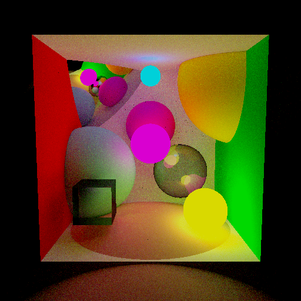

	

# WEBGLTracer

This is a WEBGL renderer.
Currently supports Path tracing on triangles and spheres with reflective and transmissive materials.

Demo available here : <https://ppipelin.github.io/webgltracer/>

## Implementation Details:
------------------------

### WebGL framework

- Texture parameters
Objects' information are stored in a texture so that it is read in the shader from this texture. This allows to pass only one uniform to pass all the objects' information. Note this texture is RGB, coded with 256 values (*uint8*).

**Store Pattern:**

|Pixel | Object's Parameter
|---------|----------------------
|0 | `Objtype, Texturetype, BSDF Number`
|1 | `Vertex1.x, Vertex1.y, Vertex1.z`
|2 | `Vertex2.x, Vertex2.y, Vertex2.z`
|3 | `Vertex3.x, Vertex3.y, Vertex3.z`
|4 | `Albedo.r, Albedo.g, Albedo.b`
|5 | `Emissive.r, Emissive.g, Emissive.b`
|6 | `Refractive Index, Shininess, empty`

### Path tracer

### UI

---

This repo is a submodule of my [personal website](pipelin.fr).
